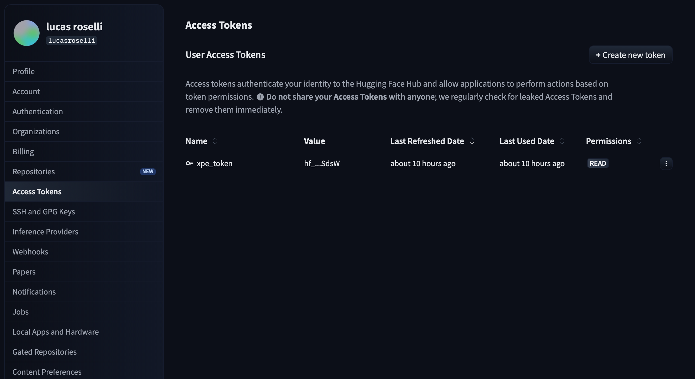
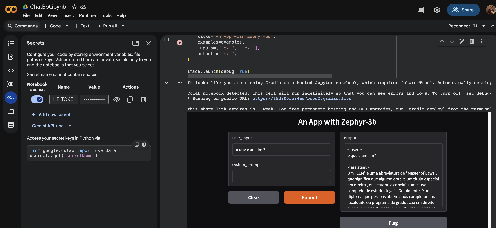
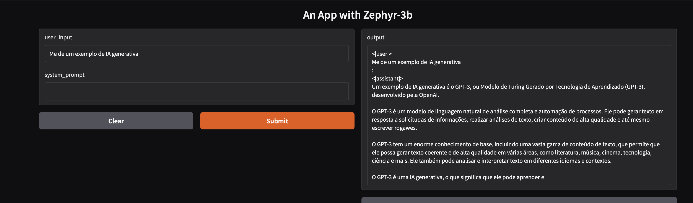
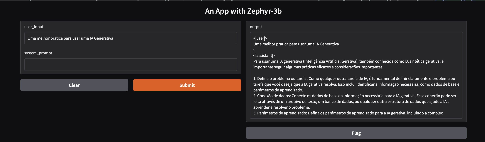
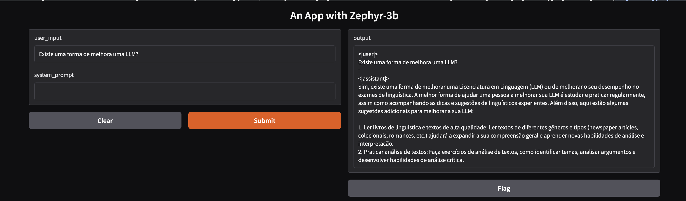
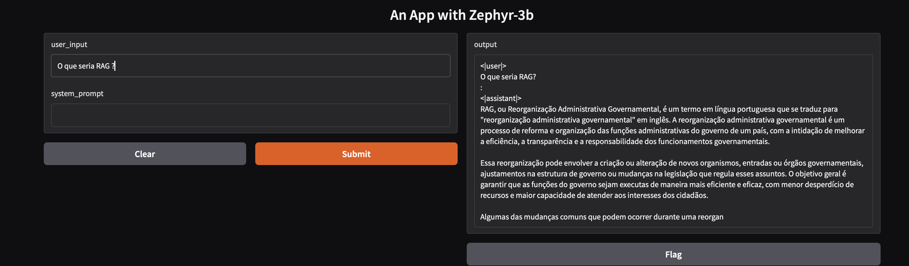

# Relatório de Entrega do Desafio Final

**Bootcamp:** Arquiteto(a) de Soluções IA Expert

**Aluno:** Lucas Leonardi Roselli

**Importante:** Nesse modulo ( diferente dos outros que fiz na XPE ) esse desafio final fiz usando a IA Generativa do ChatGTP para construir esse Readme.md, o desafio eu fiz sozinho rodando no google colab por conta, assim como ajustes necessários no código usando minha experiencia de Staff Engineer usando o exemplo passado como referencia.

---

# Introdução

O presente desafio final tem como objetivo consolidar os conhecimentos adquiridos ao longo do bootcamp, por meio da aplicação prática de conceitos relacionados à utilização de modelos de Inteligência Artificial, com foco na construção de soluções baseadas em linguagem natural.

Neste trabalho, foi desenvolvida uma aplicação de chatbot utilizando o ambiente Google Colab em conjunto com a biblioteca Hugging Face Transformers. O modelo pré-treinado utilizado foi o Zephyr-3B, permitindo a geração de respostas em linguagem natural a partir de entradas fornecidas pelo usuário.

Além disso, foi implementada uma interface gráfica com a biblioteca Gradio, possibilitando a interação direta com o chatbot de forma simples e intuitiva.

---

# Desenvolvimento da Solução do Desafio Final

## 1. Conta no Google e Acesso ao Colab

Durante o periodo do curso já tinha criado uma conta no Colab, a qual foi utilizada para acesso à plataforma Google Colab, ambiente que permite a execução de notebooks Python diretamente no navegador, sem necessidade de configuração local.

---

## 2. Upload do Notebook no Google Colab

O arquivo `ChatBot.ipynb` foi carregado no ambiente do Colab por meio da funcionalidade de upload de notebooks. Esse arquivo continha a estrutura base para implementação do chatbot disponibilizada na plataforma do XPE.

---

## 3. Execução das Células do Notebook

O notebook foi executado célula por célula, respeitando a ordem definida, garantindo o correto carregamento das bibliotecas e do modelo de linguagem.

*Encontrei alguns problemas que descrevo no item 9*

---

## 4. Integração com Hugging Face

Para utilização do modelo Zephyr-3B, foi necessário realizar autenticação na plataforma Hugging Face por meio de um token de acesso.

O token foi gerado e configurado como variável secreta no Google Colab, permitindo o download e utilização do modelo pré-treinado.

Token gerado abaixo:



Secret criada no notebook no google colab:



---

## 5. Tokenização de Texto

Foi utilizada a biblioteca `AutoTokenizer` para transformar o texto de entrada em tokens compreensíveis pelo modelo.

Durante essa etapa, foi necessário ajustar o retorno da função de tokenização, garantindo que os dados fossem convertidos corretamente em tensores compatíveis com o método `generate()` do modelo.

Este foi meu codigo final, com ajuste

```python
class ChatBot:
  def __init__(self):
    self.history = []

  def predict(self, user_input,
              system_prompt="You are an expert analyst and provide assessment:"):

    prompt = [{'role': 'user', 'content': user_input + "\n" + system_prompt + ":"}]

    inputs = tokenizer.apply_chat_template(
        prompt,
        add_generation_prompt=True,
        return_tensors='pt',
    )

    # CORREÇÃO
    if not isinstance(inputs, torch.Tensor):
        inputs = inputs["input_ids"]

    tokens = model.generate(
        inputs.to(model.device),
        max_new_tokens=250,
        temperature=0.8,
        do_sample=False
    )

    response_text = tokenizer.decode(
        tokens[0],
        skip_special_tokens=True 
    )

    del tokens
    torch.cuda.empty_cache()

    return response_text
```

---

## 6. Geração de Respostas com o Modelo

A geração de respostas foi realizada através do método `model.generate()`, utilizando parâmetros como:

* `max_new_tokens`: controle do tamanho da resposta
* `temperature`: controle da criatividade
* `do_sample`: definição do tipo de geração

Também foi necessário realizar ajustes no formato de entrada para evitar erros relacionados ao tipo de dado esperado pelo modelo.

---

## 7. Implementação da Interface com Gradio

Foi utilizada a biblioteca Gradio para criação de uma interface gráfica simples, contendo campos de entrada e saída de texto.

A interface permitiu a interação direta com o chatbot, facilitando a validação do funcionamento da aplicação.

Eu fiz um ajuste tambem para ter log mais detalhados, assim descobri com mais facilidades a falta da secret, e ajuste na classe ChatBot

```python
iface.launch(debug=True)
```

---

## 8. Testes e Ajustes

Foram realizados diversos testes com diferentes entradas de usuário, com o objetivo de avaliar a qualidade das respostas geradas.

Também foram ajustados parâmetros do modelo para observar variações no comportamento do chatbot, como respostas mais criativas ou mais objetivas.

---

## 9. Tratamento de Erros

Durante o desenvolvimento, foram encontrados alguns problemas técnicos, tais como:

* Necessidade de autenticação com token do Hugging Face
* Erros silenciosos na interface do Gradio
* Problemas no formato de entrada para o modelo

Esses problemas foram resolvidos com:

* Configuração correta de variáveis secretas
* Uso do parâmetro `debug=True` no Gradio
* Ajuste no tratamento dos dados retornados pelo tokenizer

## 10. Demo

Exemplo #1:



Exemplo #2:



Exemplo #3:



Exemplo #4:

Aqui foi um exemplo aumentando muito a temperatura para ser bem mais criativo, passando um prompt simples



---

# Conclusão

## i. Aplicação dos Conhecimentos

Os conhecimentos adquiridos ao longo do bootcamp foram aplicados de forma prática na construção do chatbot, especialmente no uso de modelos pré-treinados, tokenização de texto e integração de ferramentas de IA.

---

## ii. Principais Dificuldades e Superações

As principais dificuldades enfrentadas estiveram relacionadas à configuração do ambiente e à integração entre os componentes do sistema, como o modelo, tokenizer e interface gráfica.

Essas dificuldades foram superadas por meio de ajustes técnicos, análise de erros e entendimento mais aprofundado das bibliotecas utilizadas.

---

## iii. Resultados Obtidos

O resultado final foi a implementação de um chatbot funcional, capaz de responder perguntas em linguagem natural utilizando um modelo de linguagem avançado.

A aplicação atendeu aos objetivos propostos, demonstrando o funcionamento correto das tecnologias envolvidas.

---

## iv. Lições Aprendidas

Entre os principais aprendizados, destacam-se:

* Utilização prática de modelos de linguagem
* Importância da tokenização correta dos dados
* Integração entre diferentes ferramentas de IA
* Processo de depuração em ambientes de desenvolvimento

---

## v. Melhorias Futuras

Como melhorias futuras, podem ser consideradas:

* Implementação de memória de contexto (histórico de conversa)
* Otimização de performance com modelos mais leves
* Deploy da aplicação em ambiente produtivo
* Aprimoramento da interface gráfica

---
